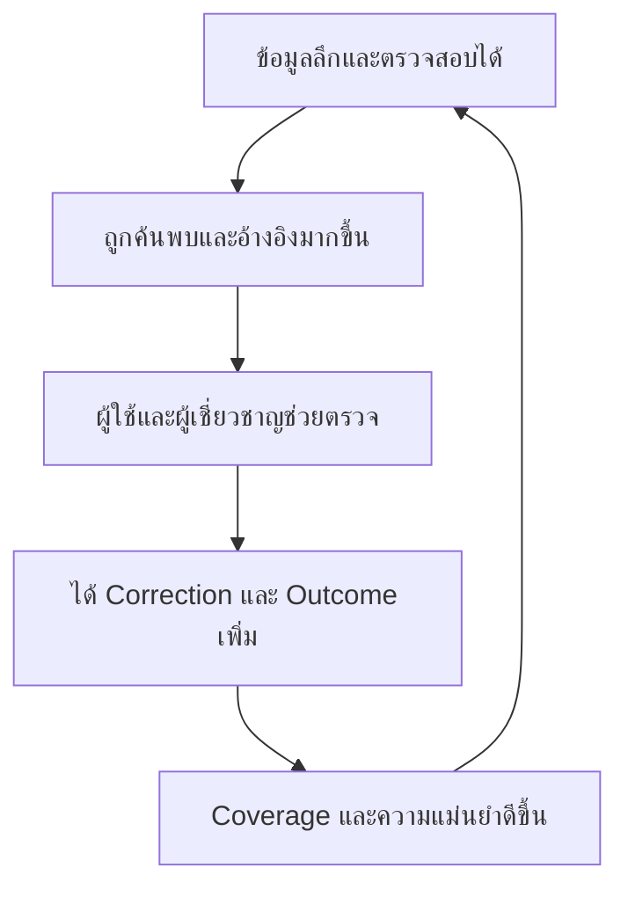

# Carmeta — Product Overview

> เอกสารกำหนดทิศทางของ Carmeta ในฐานะฐานข้อมูลรถยนต์และระบบติดตามตลาดรถประเทศไทย  
> ชื่อ `Carmeta` ยังเป็นชื่อชั่วคราว และผลิตภัณฑ์อยู่ในขั้น Prototype

## 1. Carmeta คืออะไร

Carmeta คือ **ฐานข้อมูลรถยนต์และระบบติดตามตลาดรถสำหรับประเทศไทย (Thailand Car Database & Market Intelligence)** ที่รวบรวมประวัติแบรนด์ รุ่น เจเนอเรชัน รุ่นย่อย สเปก การเปลี่ยนแปลง และราคาไว้ในโครงสร้างเดียวกัน

เป้าหมายคือสร้างพฤติกรรมว่า:

> **ก่อนซื้อรถรุ่นไหน ต้องค้นใน Carmeta ก่อน**

Positioning หลัก:

> **Carmeta — ฐานข้อมูลรถไทยที่ต้องเช็กก่อนซื้อ**

คำสัญญาระยะยาว:

> **รถแต่ละรุ่นที่อยู่ใน Coverage มีประวัติ เจเนอเรชัน การเปลี่ยนแปลง และราคาครบตามหลักฐานที่ตรวจสอบได้**

Carmeta ไม่ใช่เพียงเว็บบทความ รีวิว หรือเว็บประกาศขายรถ แต่เป็น **Data product** ที่ทำให้รถแต่ละรุ่นมีตัวตนชัดเจน เปรียบเทียบได้ ติดตามตามเวลาได้ และตรวจย้อนกลับถึงหลักฐานได้

## 2. Product thesis

ลำดับความสำคัญของผลิตภัณฑ์คือ:

1. **Car Database** — ตัวตนและรากของผลิตภัณฑ์
2. **Price Tracker** — ฟีเจอร์เรือธงและเหตุผลให้กลับมาใช้
3. **Compare & Research Tools** — เปลี่ยนข้อมูลให้ใช้ตัดสินใจ
4. **Ownership, Partner และ Marketplace** — ชั้นต่อยอดหลัง Data และ Trust แข็งแรง

หลักคิดจากเว็บไซต์ Data tracker ที่นำมาปรับใช้คือ **Entity, Version, Cohort, History, Sample และ Freshness** ไม่ใช่การลอกหน้าตาของเว็บไซต์ต้นแบบ

| ระบบ Data tracker | Carmeta |
|---|---|
| Hero / Champion | Nameplate, Generation หรือรุ่นย่อย |
| Patch / Version | Generation, Facelift, ช่วงสเปก และการปรับราคา |
| Build | Trim, Powertrain และชุดอุปกรณ์ |
| Role / Context | Segment, การใช้งาน และ Comparable cohort |
| Match history | Price observation, Listing snapshot และ Change event |
| Player profile | รถของผู้ใช้และ Digital Garage ในอนาคต |

ระบบจะไม่ใช้คะแนนเดียวประกาศว่า “รถคันใดดีที่สุด” เพราะรถไม่มี Win rate ที่เป็นกลาง และความเหมาะสมขึ้นอยู่กับบริบทของแต่ละคน

## 3. ปัญหาและกลุ่มผู้ใช้

### ปัญหาที่ต้องแก้

- ข้อมูลรถไทยกระจายอยู่ในเว็บไซต์ โบรชัวร์ ข่าว รีวิว และประกาศขาย
- ชื่อรุ่นเดียวกันอาจเป็นคนละเจเนอเรชัน Phase รุ่นย่อย Powertrain หรือสเปกตลาด
- ผู้ใช้ไม่รู้ว่ารถแต่ละช่วงเปลี่ยนอะไรและควรจ่ายเพิ่มเพื่ออะไร
- ราคาป้าย ราคาโปร ราคาประกาศ และราคาซื้อขายจริงมักถูกปะปนกัน
- ประกาศมือสองจำนวนมากจับคู่รุ่นย่อยผิด มีรายการซ้ำ หรือรวมรถคนละ Cohort
- ข้อมูลเปลี่ยนตามเวลา แต่หลายแหล่งเขียนทับข้อมูลเก่าและไม่มีประวัติ
- ยังไม่มีแหล่งอ้างอิงกลางที่บอก Source, วันที่, ความครบ และความเชื่อมั่นของข้อมูล

### กลุ่มผู้ใช้หลัก

| กลุ่ม | สิ่งที่ต้องการ |
|---|---|
| คนที่มีรุ่นในใจ | ตรวจประวัติ เจเนอเรชัน รุ่นย่อย สเปก ราคา และทางเลือก |
| คนกำลังเลือกซื้อ | ค้นหาและเปรียบเทียบรถในกลุ่มหรืองบเดียวกัน |
| ผู้ซื้อรถมือสอง | ตรวจตัวตนรถ ช่วงราคา การเปลี่ยนแปลง และสิ่งที่ควรรู้ |
| คนไม่มีพื้นฐาน | เข้าใจคำศัพท์ ระบบรถ และความหมายของข้อมูล |
| เจ้าของรถ | ติดตามราคา การเปลี่ยนแปลง และมูลค่ารถในระยะถัดไป |
| สื่อและผู้สร้างเนื้อหา | ใช้ข้อมูลที่มีโครงสร้างและอ้างอิงได้ |
| ธุรกิจรถยนต์ | ใช้ Market insight, Price intelligence, Report และ Data API |

## 4. ขอบเขตและหลักการ

### ขอบเขตเริ่มต้น

- รถที่จำหน่ายผ่านผู้แทนอย่างเป็นทางการในประเทศไทย
- รถยนต์นั่ง SUV, PPV และกระบะตาม Coverage ที่ประกาศ
- รถ Gray import, รถพาณิชย์ขนาดใหญ่ และรุ่นพิเศษที่ตรวจสอบไม่ได้เป็นระยะหลัง
- ประวัติทุกเจเนอเรชันเก็บในระดับภาพรวม ส่วน Current และ Previous generation เก็บรายละเอียดลึกกว่า
- ห้ามใช้คำว่า “ครบทั้งหมด” หาก Coverage ยังไม่ผ่านเกณฑ์ที่ประกาศ

### หลักการของผลิตภัณฑ์

1. **Database-first** — ทุกระบบอ้างอิงตัวตนรถและข้อมูลกลางชุดเดียวกัน
2. **Thailand-market first** — แยกสเปกไทยออกจากตลาดอื่นอย่างชัดเจน
3. **Evidence-first** — ข้อมูลสำคัญต้องมี Source วันที่ และขอบเขตหลักฐาน
4. **Versioned data** — เก็บประวัติการเปลี่ยนแปลงและไม่เขียนทับอดีต
5. **Exact entity matching** — แยก Generation, Phase, Trim, Powertrain และช่วงที่มีผล
6. **Context before conclusion** — ตัวเลขต้องมี Cohort ช่วงเวลา Sample และ Confidence
7. **No false precision** — ข้อมูลไม่พอต้องระบุว่าไม่พอ ไม่สร้างความแม่นยำปลอม
8. **Separate data types** — Fact, Carmeta Calculation, User-reported และ Partner data ต้องไม่ปะปนกัน
9. **Rights-aware** — ใช้ข้อมูลตามสิทธิ์ API, License หรือข้อตกลงที่อนุญาต
10. **Depth before breadth** — ทำ Coverage ให้ลึกและเชื่อถือได้ก่อนขยาย
11. **Commerce follows trust** — Marketplace และรายได้ต้องตามหลังความน่าเชื่อถือของข้อมูล

## 5. Canonical Car Taxonomy

โครงสร้างตัวตนรถหลัก:

```text
Brand (Global)
├─ Global Model Family
└─ Market Presence / Distributor (Thailand)
   └─ Thailand Market Nameplate
      └─ Generation
         └─ Derivative / Body
            └─ Phase / Facelift
               └─ Trim
                  └─ Thailand Market Variant Revision
```

`Model year` ไม่เป็นชั้นบังคับ เพราะรถไทยบางรุ่นไม่ได้ประกาศ Model year ชัดเจน ระบบใช้ `effective_from` และ `effective_to` เป็นแกนเวลา และเก็บ Model year เป็นข้อมูลเสริมเมื่อมีหลักฐาน

ต้องแยก **Model year, Production year, Registration year และ Thailand launch year** ออกจากกัน ห้ามใช้แทนกัน

| Entity | ความหมาย | ข้อมูลหลัก |
|---|---|---|
| **Brand** | ยี่ห้อทางการค้าระดับ Global | ชื่อทางการ Alias และความสัมพันธ์กับบริษัท |
| **Market Presence** | การดำเนินงานของแบรนด์ในตลาดหนึ่ง | ผู้ผลิต/ผู้นำเข้า ช่องทาง และช่วงดำเนินงานในไทย |
| **Thailand Market Nameplate** | ชื่อรุ่นที่ขายในไทยและเป็น Canonical grain | Alias, Segment, ช่วงจำหน่าย และความสัมพันธ์กับ Global Model Family |
| **Generation** | การเปลี่ยนโครงสร้างหลักของรุ่น | รหัสเจเนอเรชัน ช่วงจำหน่าย และหลักฐาน |
| **Derivative / Body** | ตัวถังหรืออนุพันธ์ที่อาจเปลี่ยนคนละเวลา | Sedan, Hatchback, Wagon, ฐานล้อ และช่วงจำหน่าย |
| **Phase** | Pre-facelift หรือ Facelift ระดับโครงสร้าง | ประเภทการเปลี่ยน ช่วงมีผล และ Change summary |
| **Trim** | เกรดการขายภายใน Phase | ชื่อมาตรฐาน Alias และช่วงวางขาย |
| **Variant Revision** | รถหนึ่งแบบที่ซื้อได้จริง ณ ช่วงหนึ่ง | Powertrain ที่อ้างอิง ชุดสเปก ที่นั่ง และช่วงมีผล |

สร้าง `Phase` แรกเมื่อเปิดตัว และสร้าง Phase ใหม่เฉพาะ Facelift หรือการเปลี่ยนโครงสร้างชุดใหญ่ การเปลี่ยนอุปกรณ์หรือสเปกย่อยให้สร้าง `Variant Revision + Change Event`; การเปลี่ยนราคาอย่างเดียวให้สร้าง `Official Price Observation + Change Event` โดยไม่เปลี่ยนตัวตนรถ

`Engine`, `Motor`, `Battery`, `Transmission` และ `Drivetrain` เป็น Entity แบบ Versioned ที่ `Variant Revision` อ้างอิง ไม่ใช่ชั้นบังคับในลำดับ เพราะหนึ่ง Revision อาจประกอบด้วยหลายระบบร่วมกัน

### Entity สนับสนุน

- **Alias Mapping** — จับชื่อรุ่นจากเอกสารและประกาศให้เข้ารหัสกลาง
- **Evidence Source** — ผู้เผยแพร่ เอกสาร วันที่ สิทธิ์ และผู้ตรวจ
- **Official Price Observation** — ราคาป้ายหรือการปรับราคาที่ไม่เขียนทับประวัติ
- **Promotion Observation** — โปรโมชันพร้อมเงื่อนไข
- **Listing** — ตัวตนของประกาศหนึ่งรายการหลัง Dedupe
- **Listing Snapshot** — ราคา เลขไมล์และสถานะของ Listing ณ วันที่สังเกต ใช้คำนวณ Supply และ Days on market
- **Change Event** — เปิดตัว Facelift เปลี่ยนสเปก ปรับราคา Recall และเลิกขาย
- **Market Statistic Snapshot** — Median, ช่วงราคา Sample และนิยาม Cohort ณ วันคำนวณ
- **Physical Vehicle** — รถจริงแต่ละคัน เป็น Entity หลัง MVP เมื่อมีเรื่อง VIN/ทะเบียน ความยินยอม และการเชื่อมหลาย Listing

ทุกค่ารองรับสถานะ `known`, `unknown` และ `not_applicable` เพื่อไม่ใช้เลขศูนย์แทนข้อมูลที่ไม่มี

## 6. ชั้นข้อมูลของ Carmeta

| ชั้นข้อมูล | เนื้อหา |
|---|---|
| **Reference Data** | ประวัติแบรนด์และ Nameplate, Generation, Phase, Trim, Powertrain, สเปก, อุปกรณ์, ความปลอดภัยและการรับประกัน |
| **Change Data** | เปิดตัว Facelift เปลี่ยนสเปก เพิ่ม/ตัดรุ่นย่อย ปรับราคา Recall และเลิกขาย |
| **Market Data** | ราคาป้าย ราคาโปร ราคาประกาศมือสอง Supply, Days on market และยอดจดทะเบียนเมื่อมีสิทธิ์ |
| **Derived Intelligence** | Median, ช่วงราคา, ค่าเสื่อม, การรักษามูลค่า, Fair Price, TCO และ Market index เมื่อข้อมูลพร้อม |
| **Outcome Data** | ราคาซื้อจริง ผลตรวจ ค่าดูแล ค่าประกัน และราคาขายต่อจากข้อมูลที่มีสิทธิ์ในระยะหลัง |

Known issues และความทนทานต้องเริ่มจาก Recall, Service bulletin, ผลตรวจ หรือ Outcome ที่ตรวจสอบได้ ประสบการณ์เจ้าของใช้เป็น Signal พร้อม Sample และไม่เปลี่ยนเป็นข้อเท็จจริงอัตโนมัติ

## 7. ระบบข้อมูลสาธารณะ

### 7.1 Car Market Database

- ค้นหาจาก Brand, Nameplate, Generation, Phase, Trim, Powertrain และช่วงราคา
- แยกรถปัจจุบัน รถเลิกจำหน่าย รถใหม่ และรถมือสอง
- รองรับข้อมูลราคา การเปลี่ยนแปลง Supply และความครบของข้อมูล
- ทุกผลลัพธ์เชื่อมกลับไปยัง Canonical Entity เดียวกัน

### 7.2 Brand Hub

- ประวัติแบรนด์ในประเทศไทย
- Nameplate ที่เคยและกำลังจำหน่ายตาม Coverage ที่ประกาศ
- Generation tree และช่วงเวลาสำคัญของแต่ละรุ่น
- รุ่นปัจจุบัน รุ่นยุติจำหน่าย และรุ่นที่กำลังเปลี่ยนผ่าน
- ภาพรวมราคาและ Change event ของแบรนด์

### 7.3 Model / Nameplate Hub

- ประวัติของชื่อรุ่นและตลาดที่เกี่ยวข้อง
- เจเนอเรชันทั้งหมดและช่วงเวลาจำหน่ายในไทย
- ความสัมพันธ์ระหว่างตัวถัง รุ่น และชื่อที่เคยใช้
- ภาพรวมราคา การรักษามูลค่า และรถทางเลือกเมื่อข้อมูลพร้อม

### 7.4 Generation และ Phase Profile

- วันเปิดตัว Facelift และยุติจำหน่าย
- ตัวถัง ขนาด Powertrain เทคโนโลยี และสเปกตลาดไทย
- Phase, Trim และ Variant Revision ที่อยู่ในเจเนอเรชัน
- การเปลี่ยนแปลงตามเวลา ราคา Recall ความปลอดภัยและการรับประกัน

### 7.5 Trim และ Variant Revision Profile

- สเปก อุปกรณ์ Powertrain และ Market spec ที่ตรงกัน
- ราคาและช่วงเวลาที่มีผล
- สิ่งที่เพิ่มหรือลดจากรุ่นย่อยหรือ Revision ใกล้เคียง
- Model year เมื่อมีหลักฐาน
- Source และ Revision history

### 7.6 Change Timeline

- รวมการเปิดตัว Facelift การเปลี่ยนสเปก การปรับราคา Recall และเลิกจำหน่าย
- ระบุค่าก่อน–หลัง วันที่มีผล Source และ Entity ที่ได้รับผล
- รองรับ Change log ระดับตลาด แบรนด์ Nameplate, Generation และ Variant

### 7.7 Compare และ Research Tools

- เปรียบเทียบระดับ Generation, Phase, Trim หรือ Variant Revision
- ป้องกันการเทียบรถคนละตลาดหรือคนละชนิดราคาโดยไม่แจ้ง
- เทียบราคา สเปก อุปกรณ์ Powertrain ต้นทุน และข้อมูลที่ขาด
- อธิบายว่าเพิ่มเงินเท่าไรและได้อะไรเพิ่ม
- Knowledge glossary เชื่อมคำศัพท์เข้ากับข้อมูลรถและหลักฐาน

### 7.8 Watchlist

- บันทึก Brand, Nameplate, Generation หรือ Variant ที่สนใจ
- ติดตามราคา Change event และข้อมูลใหม่
- Price Alert และ Change Alert เป็นระบบหลัง MVP

### 7.9 Methodology, Evidence และ Correction

- ทุกข้อมูลมี Source, Effective date, Checked date และขอบเขตหลักฐาน
- Derived metric มีนิยาม สูตร Cohort, Sample, Confidence และ Formula version
- เก็บ Revision history และ Correction log
- เปิดรับการแจ้งข้อมูลผิดพร้อมหลักฐาน
- ระบุข้อมูลขาด ล้าสมัย ขัดแย้ง หรือยังไม่เพียงพอ

## 8. Price & Market Intelligence

Price Tracker เป็นฟีเจอร์เรือธงที่ทำให้ฐานข้อมูลรถมีมิติตามเวลาและสร้างเหตุผลให้ผู้ใช้กลับมา

### 8.1 นิยามราคา

| ประเภท | ความหมาย |
|---|---|
| **ราคาป้ายมือหนึ่ง** | ราคาขายปลีกที่ผู้ผลิตหรือผู้นำเข้าประกาศ |
| **ราคาโปรที่ประกาศ** | ราคาหรือส่วนลดที่ตรวจสอบ Source และเงื่อนไขได้ |
| **ค่ามัธยฐานราคาประกาศมือสอง** | ค่ากลางของราคาตั้งขาย ไม่ใช่ราคาซื้อขายจริง |
| **ช่วงราคาประกาศ** | ช่วงกลางของตัวอย่าง เช่น Percentile 25–75 |
| **ราคาซื้อขายจริง** | ใช้เมื่อมีข้อมูลธุรกรรมและสิทธิ์ที่ตรวจสอบได้เท่านั้น |
| **ช่วงราคาประเมิน** | ผลแบบจำลองตามปี ไมล์ สภาพและพื้นที่ พร้อมสมมติฐาน |

### 8.2 Market Tracker และ Price Timeline

- ราคาป้ายปัจจุบัน ราคาเปิดตัว และประวัติการปรับราคา
- Median มือสอง ช่วง 25–75%, Sample, Supply และ Confidence
- การเปลี่ยนแปลง 30 วัน 1 ปี และช่วงเวลาที่ยาวกว่าเมื่อข้อมูลพร้อม
- Snapshot รายสัปดาห์หรือรายเดือนแบบ Append-only
- เชื่อมเหตุการณ์เปิดตัว Facelift เปลี่ยนสเปก ปรับราคาและเลิกขาย
- แยกแนวโน้มราคาตามเวลาออกจากค่าเสื่อมตามอายุรถ
- Price index และดัชนีฐาน 100 เป็นระบบระยะถัดไป

### 8.3 Comparable Cohort

ราคามือสองต้องจัดกลุ่มด้วยข้อมูลที่เทียบกันได้ เช่น:

- Generation และ Phase
- Trim หรือ Variant Revision
- Powertrain
- อายุรถและปีจดทะเบียน
- ช่วงเลขไมล์
- พื้นที่และประเภทผู้ขาย
- สภาพหรือสถานะพิเศษเมื่อระบุได้

ห้ามรวมรถต่างเจเนอเรชันหรือคนละ Cohort เพื่อสร้างราคากลางเดียว

### 8.4 กฎคุณภาพราคา

- ใช้ Median และ Percentile ไม่ใช้ค่าเฉลี่ยหรือราคาต่ำสุด–สูงสุดเพียงอย่างเดียว
- รวมประกาศซ้ำและรีลิสต์ด้วยกฎที่ตรวจสอบได้ ส่วนราคาเหยื่อหรือ Outlier ให้ Quarantine พร้อมเหตุผล ไม่ลบทิ้งเงียบ ๆ
- แยกปีจดทะเบียนออกจาก Model year
- แสดง Sample และ Confidence ทุกครั้ง
- ข้อมูลไม่พอให้ระบุว่า “ยังสรุปราคาไม่ได้”
- ห้ามเรียกราคาประกาศว่า “ราคาขายจริง”
- ประวัติย้อนหลังเริ่มจาก Snapshot ที่เก็บจริง
- Backfill เฉพาะแหล่งที่มีสิทธิ์และหลักฐาน ห้ามสร้างประวัติจากการคาดเดา

### 8.5 แหล่งข้อมูลและสิทธิ์

1. เว็บไซต์ โบรชัวร์ Price list และประกาศทางการของผู้ผลิตหรือผู้นำเข้า
2. หน่วยงานรัฐ Recall และผลทดสอบที่ตรงตลาด
3. Inventory หรือ Marketplace ที่มี API, License หรือข้อตกลง
4. Dealer, Auction, Finance และ Partner ที่ส่งข้อมูลอย่างถูกสิทธิ์
5. ข้อมูลจากผู้ใช้ที่ให้ความยินยอมและระบุสถานะชัดเจน

Carmeta จะไม่วางแผนโดยสมมติว่าสามารถ Scrape เว็บไซต์ใดก็ได้ และจะไม่เผยแพร่ข้อมูลที่ไม่มีสิทธิ์เก็บหรือแสดง

## 9. Data Platform และระบบหลังบ้าน

| ระบบ | หน้าที่ |
|---|---|
| **Car Knowledge Graph** | จัดการ Stable ID, Alias และความสัมพันธ์ของรถทุก Entity |
| **Evidence Ledger** | เก็บ Source, License, Effective date, Checked date, Confidence และ Revision |
| **Observation Store** | เก็บ Official price, Listing และ Listing snapshot แต่ละครั้งโดยไม่เขียนทับ |
| **Change Detection** | ตรวจพบเอกสารใหม่ การเปิดตัว การปรับราคาและสเปก |
| **Price Data Studio** | จับคู่รถ เชื่อมรายการซ้ำ จัด Cohort, Quarantine Outlier และสร้าง Snapshot |
| **Editorial & Data Studio** | ตรวจทาน แก้ไข อนุมัติและเผยแพร่ข้อมูล |
| **Data Quality Monitor** | ตรวจ Completeness, Freshness, Conflict และ Mapping error |
| **Search Index** | ค้นหา Alias ชื่อเก่า ชื่อไทย–อังกฤษ และความสัมพันธ์ของรุ่น |

Data pipeline หลัก:

`Acquire → Normalize → Match → Dedupe → Verify → Publish → Monitor → Correct`

## 10. Prototype และ MVP

### 10.1 Prototype: 0–8 สัปดาห์

- ลงข้อมูลสาธารณะแบบลึก 1 แบรนด์และ 3–5 Nameplate ที่มีความสนใจสูง
- ทดสอบ Schema เพิ่มอย่างน้อย 3 รูปแบบจากหลายแบรนด์: ICE หลายตัวถัง, กระบะ/PPV และ EV เพื่อป้องกันโครงสร้าง Overfit
- ทุก Generation ในระดับภาพรวม
- Current และ Previous generation ในระดับ Phase, Trim และ Variant Revision
- สเปกและราคามือหนึ่งจากแหล่งทางการ
- Brand, Model, Generation, Variant, Change, Price และ Evidence data
- Compare ระดับ Exact entity
- ชุดข้อมูลมือสองที่มีสิทธิ์ หรือ Demo ที่ระบุสถานะชัดเจน

Demo ใช้พิสูจน์โครงสร้างและการคำนวณเท่านั้น การพิสูจน์คุณภาพราคา ความสด และความเป็นไปได้ทางธุรกิจต้องใช้ข้อมูลจริงที่มีสิทธิ์อย่างน้อยหนึ่งแหล่ง

สิ่งที่ไม่อยู่ใน Prototype แรก: Meta, Fit Advisor, Lead, Sponsor, Marketplace, Payment, AI Advisor, Transaction price ที่ไม่มีแหล่งข้อมูล และ Account เต็มรูปแบบ

### 10.2 กลยุทธ์ Coverage: Depth × Breadth × Time

- **Depth:** ทำ 3 Nameplate แบบครบทุก Generation และ Major phase เท่าที่มีหลักฐาน
- **Breadth:** ทำ Current และ Previous generation ของรถ Search intent สูง 15–20 Nameplate
- **Time:** เริ่ม Price snapshot อย่างน้อย 5 Nameplate ตั้งแต่ระบบเริ่มเก็บข้อมูล

Public MVP ระยะ 3–6 เดือนตั้งเป้า 15–20 Nameplate และประมาณ 250–500 Variant Revision เมื่อมีทีมข้อมูลประจำอย่างน้อย Data Engineer 1 คนและ Research/QA 2 คน

หากทำคนเดียว ให้ใช้ Roadmap 6–9 เดือนที่ 5–8 Nameplate หรือประมาณ 100–200 Variant Revision แทนการลดมาตรฐานข้อมูล

### 10.3 Quality gate เบื้องต้น

- Identity, Market/Channel, Effective date, Status, Price type และ Evidence ต้องครบ 100%; สเปกที่ไม่ Critical ต้องครบอย่างน้อย 95%
- Variant ใน Price list ทางการต้องถูก Canonicalize 100% หรือประกาศว่า Coverage ชุดนั้นยังไม่สมบูรณ์
- ทดสอบ Auto-match บน Human-labeled holdout: Precision อย่างน้อย 95%, Recall อย่างน้อย 80% และรายงาน Unmatched rate; เป้าหมาย Precision 97% ก่อนขยาย Coverage มาก
- รายการไม่แน่ใจเก็บเป็น `unmatched` แทนการฝืนจับคู่
- Pilot threshold เริ่มที่ Unique active listings 20 รายการภายใน 90 วันหลัง Dedupe แต่จะสรุปราคาตลาดได้ต่อเมื่อ Freshness, Distribution, Source/Seller diversity และ Confidence ผ่านเกณฑ์ร่วมกัน
- Sample 5–19 รายการแสดงได้เฉพาะสถานะ “ข้อมูลจำกัด”
- Sample ต่ำกว่า 5 รายการยังไม่สรุปราคาตลาด
- อัปเดตประกาศอย่างน้อยรายสัปดาห์ และข้อมูลทางการภายในเป้าหมาย 5 วันทำการ
- ไม่เผยแพร่หน้าข้อมูลบางเพื่อเพิ่มจำนวนหน้า
- ต้องผ่าน Quality gate ต่อเนื่องก่อนเพิ่ม Coverage ชุดใหม่

## 11. Roadmap

Roadmap หลักสมมติว่ามีทีมข้อมูลประจำ 3 คนตามข้อ 10.2; หากทำคนเดียวให้ใช้ขอบเขตและเวลาของ Solo scenario

| ระยะ | เป้าหมาย |
|---|---|
| **0–3 เดือน: Data Foundation** | Canonical taxonomy, Source audit, Evidence workflow, Prototype หนึ่งแบรนด์ และ Price history เริ่มต้น |
| **3–6 เดือน: Public Database MVP** | 15–20 Nameplate, Entity hierarchy, Compare, Change timeline, Official price และ Used-data pilot |
| **6–12 เดือน: Market Tracker** | ขยาย Coverage, Used-price snapshot, Watchlist, Alert, Correction system และ Search growth |
| **12–24 เดือน: Data Authority** | Depreciation, Ownership cost, Safety/maintenance data, Market index, Verified outcome และ B2B pilot |
| **หลังผ่าน Gate: Platform Expansion** | Digital Garage, Partner feed, Decision tools, Data API และ Trusted Marketplace ตามความพร้อม |

การขยายแต่ละระยะยึด Coverage, Accuracy, Freshness, Rights และต้นทุนดูแล ไม่ใช้เวลาเป็นเงื่อนไขเดียว

## 12. Data moat และ Growth loop

Data moat ของ Carmeta คือ:

1. Canonical Car Graph สำหรับตลาดไทย
2. Exact-entity normalization และ Alias history
3. Price Timeline และ Change history ที่สะสมต่อเนื่อง
4. Evidence Ledger, Source rights และ Revision history
5. Correction workflow และ Data quality operation
6. Direct feed และ Verified outcome ในอนาคต
7. ความน่าเชื่อถือในฐานะแหล่งอ้างอิงกลาง



ใช้คำค้นที่ไม่พบผลเป็น Data backlog และสร้าง Entity สำหรับ Search เฉพาะเมื่อผ่าน Completeness threshold เพื่อหลีกเลี่ยง Thin page

## 13. ตัวชี้วัด

North Star Metric:

> **Monthly Informed Research Users** — ผู้ใช้ที่เข้าถึงข้อมูลระดับ Generation หรือ Variant ตรวจราคาและหลักฐาน แล้วทำ Research action เช่น Compare, Save, Track หรือ Share

| มิติ | ตัวชี้วัดหลัก |
|---|---|
| **Coverage** | จำนวน Entity ที่ผ่านเกณฑ์ และสัดส่วน Search demand ที่มีข้อมูลเพียงพอ |
| **Accuracy** | Matching precision/recall, Unmatched rate, Duplicate rate และ Mapping error |
| **Freshness** | Checked-date coverage และเวลาจากประกาศทางการถึงการอัปเดต |
| **Evidence** | Source/license coverage และ Derived metric ที่อธิบายย้อนหลังได้ |
| **Utility** | Search-to-entity success, Profile-to-price/evidence, Compare/Save/Track และ Returning research users |
| **Authority** | Branded search, Direct traffic, Backlink, Citation และการนำข้อมูลไปใช้โดยสื่อหรือธุรกิจ |
| **Trust** | Correction turnaround, ความเข้าใจชนิดราคา และ Perceived neutrality |

## 14. โมเดลรายได้

ลำดับรายได้ที่สอดคล้องกับ Data-first positioning:

1. B2B Market intelligence, Price/Residual report และ Data API
2. Premium tracker, Alert, Historical data และ Advanced research tools
3. เครื่องมือข้อมูลสำหรับ Dealer, สื่อ และธุรกิจรถ
4. Sponsored data placement ที่แยกจากผลปกติ
5. Qualified referral หรือ Booking fee ในระยะหลัง
6. Marketplace และ Transaction fee เมื่อ Data, Trust, Supply และ Operations พร้อม

รายได้ไม่สามารถซื้ออันดับ ข้อสรุป หรือการแก้ข้อมูลได้ และ Carmeta ไม่ขายข้อมูลส่วนบุคคลดิบ

## 15. ระบบในอนาคต

### Decision Intelligence

- Advanced Compare, Fair Price, TCO และ Ownership risk
- Fit Advisor และ Decision report
- Checklist ทดลองขับ ตรวจรถ และต่อรอง
- AI ใช้ค้นและอธิบายข้อมูลจาก Evidence Ledger พร้อม Citation เท่านั้น

### Digital Garage

- รถที่เป็นเจ้าของ ประวัติ Service และค่าใช้จ่าย
- Maintenance, Recall, Warranty และ Insurance reminder
- มูลค่าปัจจุบัน แนวโน้มขายต่อ และ Vehicle passport ที่ผู้ใช้ควบคุม

### Partner Ecosystem

- ผู้ผลิต ผู้นำเข้า Dealer และเต็นท์รถ
- บริษัทตรวจสภาพ ประกันและสินเชื่อที่ได้รับอนุญาต
- ศูนย์บริการ อู่ ยาง แบตเตอรี่ Car care, Roadside และ EV charging
- Trade-in, Auction และบริการโอนรถ

เลือก Partner ที่เพิ่มข้อมูลและความน่าเชื่อถือก่อน Partner ที่ให้รายได้สูงเพียงอย่างเดียว

### Trusted Marketplace

- Listing ต้องจับคู่ระดับ Exact variant
- Fair price ใช้ Comparable cohort, Sample และ Confidence
- Inspection report และ Price history เชื่อมด้วยหลักฐาน
- Organic ranking ไม่ถูกซื้อด้วยค่าโฆษณา
- เริ่มจาก Inventory feed, Lead, Test-drive และ Inspection booking ก่อน Payment หรือการโอน

Marketplace เปิดเมื่อ Canonical data, Traffic, Supply density, Legal, Dispute process และ Unit economics ผ่าน Gate ไม่ผูกกับปีตายตัว

## 16. สิ่งที่ไม่ควรทำในระยะแรก

- เปิดหลายแบรนด์แต่ข้อมูลแต่ละแบรนด์บางหรือจับรุ่นผิด
- สร้างหน้า Search จำนวนมากจากข้อมูลไม่ครบ
- เรียกราคาประกาศว่าราคาซื้อขายจริง
- รวมรถคนละ Generation, Phase หรือ Trim เพื่อเพิ่ม Sample
- สร้างประวัติราคาย้อนหลังจากการคาดเดา
- พึ่ง Scraping ที่ไม่มีสิทธิ์
- สรุปความทนทานจากความคิดเห็นจำนวนน้อย
- ทำ Tier list ที่ประกาศรถดีที่สุดโดยไม่มีบริบท
- ใช้ AI เติมข้อมูลที่ไม่มีหลักฐาน
- เปิด Marketplace ก่อน Data และ Trust แข็งแรง

## 17. เป้าหมายของ Prototype

Prototype ต้องตอบให้ได้ว่า:

- เราสร้าง Canonical database ที่แยกรถไทยได้ถูกถึงระดับ Variant Revision หรือไม่
- ผู้ใช้แยก Generation, Phase, Trim, Powertrain และช่วงที่สเปกมีผลได้หรือไม่
- ผู้ใช้หาราคาปัจจุบัน ประวัติราคา Change event และ Source ได้หรือไม่
- ผู้ใช้แยกราคาป้าย ราคาโปร ราคาประกาศ และราคาซื้อขายจริงได้หรือไม่
- ระบบจับคู่ข้อมูล ลบรายการซ้ำ เก็บ Snapshot และแก้ Revision ได้ต่อเนื่องหรือไม่
- ทีมรักษา Completeness, Accuracy, Freshness และ Rights ภายใต้ต้นทุนที่รับไหวหรือไม่
- ข้อมูลลึกพอให้ผู้ใช้กลับมาใช้ อ้างอิง และแนะนำ Carmeta ก่อนซื้อรถหรือไม่

ข้อสรุปที่ต้องพิสูจน์คือ:

> **Carmeta สามารถเป็นฐานข้อมูลรถไทยที่ลึก ถูก ตรวจสอบได้ อัปเดตต่อเนื่อง และกลายเป็นแหล่งอ้างอิงก่อนซื้อรถได้จริงหรือไม่**

## 18. แหล่งอ้างอิงแนวคิด

- [Dotabuff](https://www.dotabuff.com/) — Entity database, history และ trends
- [Dota2ProTracker](https://dota2protracker.com/) — Cohort, sample, freshness และข้อจำกัดข้อมูล
- [OP.GG Champions](https://op.gg/lol/champions) — Contextual statistics และ entity comparison
- [Tracker.gg LoL](https://tracker.gg/lol) — Profile, history และ repeat-use loop
- [JATO Specifications](https://www.jato.com/our-capabilities/specifications) — Automotive specifications และ data business
- [Kelley Blue Book Car Prices](https://www.kbb.com/car-prices/) — Price range และ market methodology
